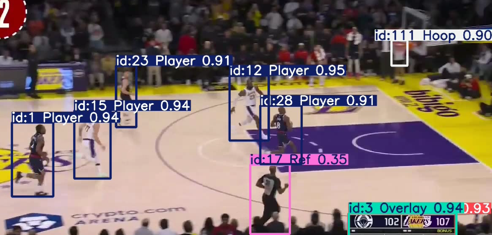

# Basketball Analysis(in progess)

## Overview
- Detecting and Tracking in game basketball court

## Aim
- Analysing in game stats(FGA(Field Goal Attempt), FGM(Field Goal Made), ball occupation rate)
  
## Importance of the Challenge
- 내용
  
## Yield Estimation
- 내용

## Challenge Details
- 내용

## Technologies Used
Programming Language: Python
Libraries           : YOLO, OpenCV
